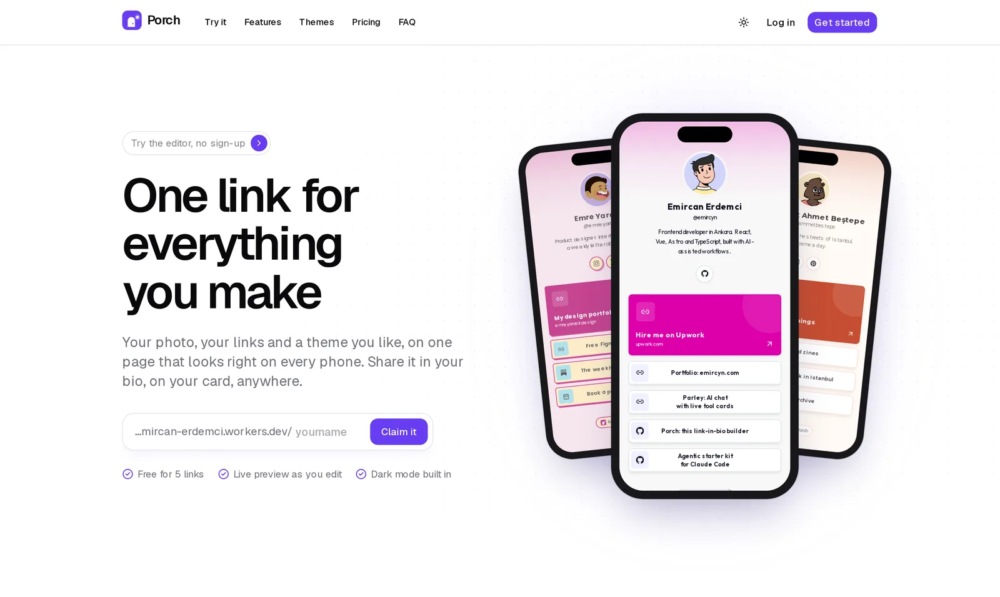
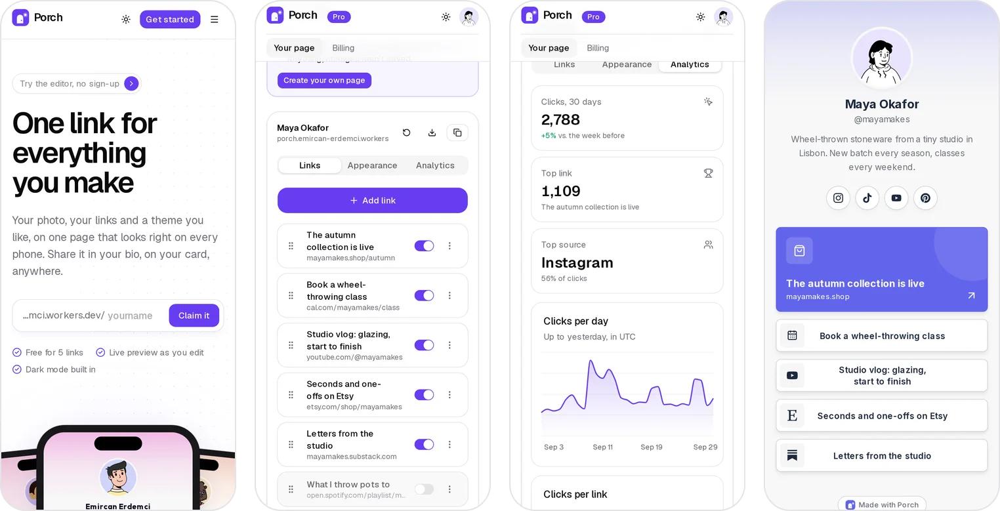
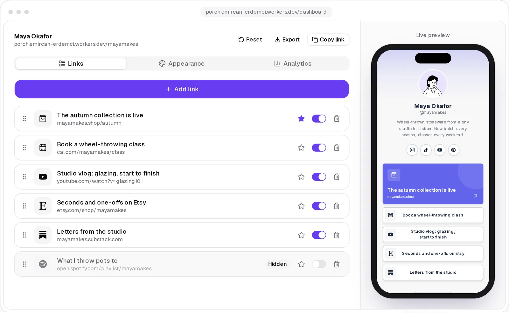
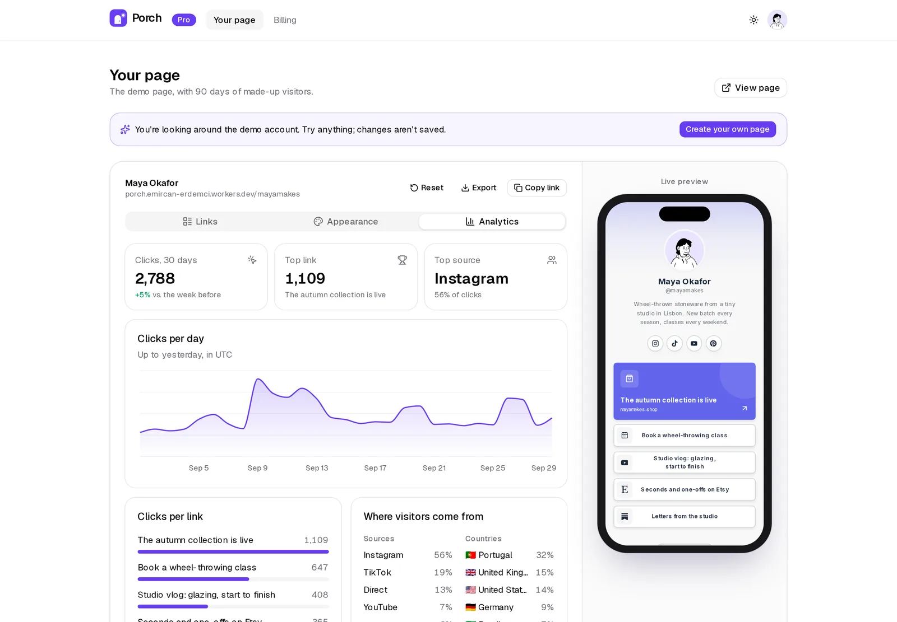
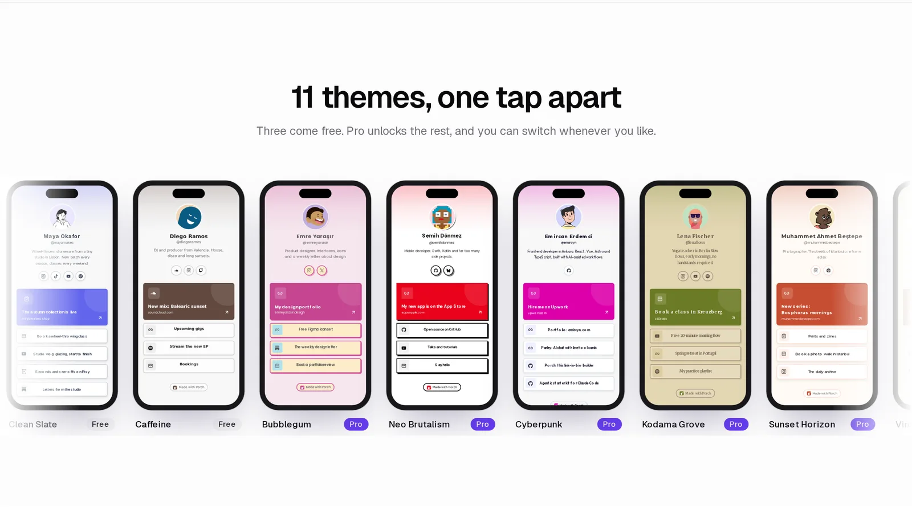
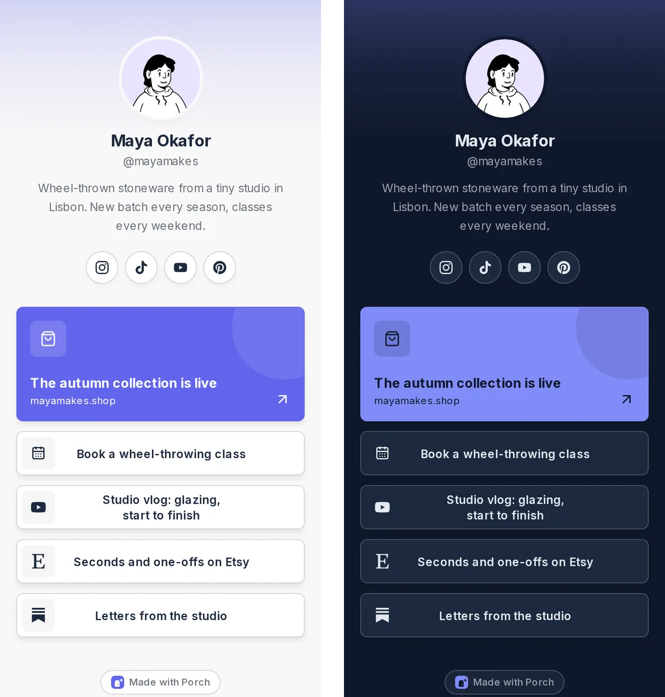

# Porch

[](https://github.com/Emircyn/porch/actions/workflows/ci.yml)

A link-in-bio page builder: sign up, add your photo, links and a theme, and share one short address.
Built from idea to working MVP with Next.js, Supabase and Stripe, deployed on Cloudflare Workers.

**Live:** [porch.emircan-erdemci.workers.dev](https://porch.emircan-erdemci.workers.dev) · **One-click demo account:** [/demo](https://porch.emircan-erdemci.workers.dev/demo) (no sign-up) · Test card: `4242 4242 4242 4242`

<picture>
  <source media="(prefers-color-scheme: dark)" srcset="docs/hero-dark.webp">
  
</picture>

## What it does

- **Editor with a live phone preview.** Drag links into order (mouse, touch or keyboard), feature one as a big
  card (YouTube links get their thumbnail), hide links without deleting them, undo a delete. Titles are
  suggested from the address. Every change saves as you type and shows on the phone straight away.
- **12 themes, each with a dark mode.** Real shadcn/ui themes imported from [tweakcn](https://tweakcn.com);
  the page follows the visitor's own light or dark setting.
- **Free and Pro plans (Stripe, test mode).** Free: 5 links and 3 themes. Pro ($5/month): unlimited links,
  every theme and click analytics. Checkout, the Customer Portal and signed webhooks.
- **Analytics.** Clicks per day and per link, top sources and countries, counted without cookies.
- **Public pages at `/<username>`.** Cached, tiny, and quick in Instagram's and TikTok's in-app browsers.
- **A read-only demo account** with 90 days of believable traffic, one click away.

### On a phone

Every screen is built for phones first: the landing page, the editor (drag handles, a menu for each link,
a Preview button), analytics and the public page.

<picture>
  <source media="(prefers-color-scheme: dark)" srcset="docs/mobile-dark.webp">
  
</picture>

### Editor and analytics

<picture>
  <source media="(prefers-color-scheme: dark)" srcset="docs/editor-dark.webp">
  
</picture>

<picture>
  <source media="(prefers-color-scheme: dark)" srcset="docs/analytics-dark.webp">
  
</picture>

### Themes

<picture>
  <source media="(prefers-color-scheme: dark)" srcset="docs/themes-dark.webp">
  
</picture>

The public page follows the visitor's own light or dark setting:



<sub>Screenshots follow your GitHub theme: switch between light and dark to see both.</sub>

## Stack

Next.js 16 (App Router) · TypeScript · Tailwind CSS 4 · shadcn/ui · Supabase (Postgres, Auth, Storage) ·
Stripe · Cloudflare Workers via OpenNext · Vitest · dnd-kit · Recharts · Magic UI

## Decisions worth a look

- **The database enforces the plan, not just the UI.** The 5-link limit, Pro-only themes and "users can't
  change their own plan" live in Postgres triggers, column grants and row-level security
  (`supabase/migrations`). Visitors can't read any table; public pages come from one `security definer`
  function. Tested against a real Postgres (PGlite) in `tests/db.test.ts`.
- **Stripe webhooks are the only thing that changes a plan.** Each event re-reads the subscription from Stripe,
  so events arriving late, twice or out of order can't undo newer state (`src/lib/stripe-webhook.ts`).
  Signatures are checked with WebCrypto so it runs on Workers.
- **Public pages ship almost no JavaScript.** They have their own root layout (no theme switcher, toasts or
  animation libraries), dark mode comes from CSS alone, and clicks are counted with `navigator.sendBeacon`
  instead of a redirect, so links go straight to where they point. Lighthouse (mobile): 98 / 100 / 100 / 100.
- **Themes are fixed to WCAG AA on import.** Ten of the twelve tweakcn themes failed contrast somewhere;
  `scripts/import-page-themes.mjs` measures every pair and adjusts OKLCH lightness until it passes.
- **Phone previews use real iPhone 16 geometry.** The page is laid out at 393 px (the real viewport) and
  scaled into a frame built from Apple's measurements, so the preview matches the phone
  (`src/components/phone-frame.tsx`).
- **Link previews cost the Worker nothing.** Every theme page and every user page has an Open Graph card in
  its own theme (`public/og`), drawn with the real components and screenshotted ahead of time by
  `npm run og:build`, instead of rendering images on each request with `ImageResponse`.
- **The Worker went from 2.65 MiB to 1.64 MiB** (gzip) to fit the free plan's 3 MiB: `zod/mini`, no Supabase
  client in the browser, and a webpack build so shared modules aren't duplicated per route.
- **The demo can't be vandalised.** Its editor runs locally, and database triggers refuse writes to the demo
  account even with the demo's own token.

## Run it locally

```bash
npm install
cp .env.example .env.local        # fill in Supabase and Stripe (test mode) keys
npm run db:push                   # apply supabase/migrations
npx dotenv -e .env.local -- node scripts/stripe-setup.mjs   # creates the Pro price; copy the id into .env.local
npm run seed:demo                 # optional: the demo account
npm run dev
```

For local webhooks: `stripe listen --forward-to localhost:3000/api/stripe/webhook`, then put the printed
secret in `STRIPE_WEBHOOK_SECRET`.

```bash
npm test          # 61 tests: webhooks, plan rules on Postgres, helpers
npm run lint
npm run typecheck
```

The same three run in CI on every push and pull request.

## Deploy

`npm run deploy` shows the plan and changes nothing; `npm run deploy -- --yes` creates the KV namespaces for
the page cache, registers the Stripe webhook for the live URL, uploads secrets, points Supabase auth at the
live site, builds and deploys to Cloudflare Workers. It needs `wrangler login` and the keys in `.env.local`.

## Credits

Themes from [tweakcn](https://tweakcn.com) · brand icons from [Simple Icons](https://simpleicons.org) (CC0) ·
demo avatars from [DiceBear](https://www.dicebear.com/licenses/) (styles by Micah Lanier, Ashley Seo,
Lisa Wischofsky, Draftbit, vijay verma and Johan Melin under CC BY 4.0; Pablo Stanley; Zoish and others under CC0).

## Licence

MIT, see [LICENSE](LICENSE). The demo avatars keep their own licences (see Credits).

Porch is a portfolio project by Emircan Erdemci. Stripe runs in test mode: no real money moves.
